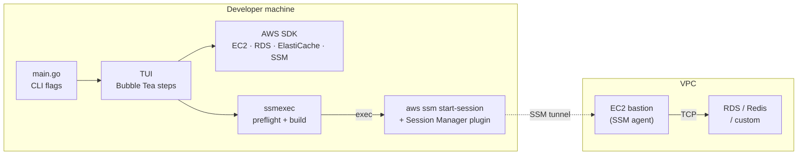
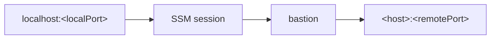

# Architecture

## Problem burrow solves

Private AWS resources (RDS, ElastiCache, internal services) are not reachable from a developer laptop. Traditional options include VPN, a dedicated jump host with SSH, or manual SSM port-forwarding commands.

burrow automates the setup: it discovers resources and bastions via AWS APIs, validates network reachability where possible, saves connection profiles locally, and starts an SSM port-forward session through the AWS CLI.

## High-level diagram



Traffic path once connected:



## Layered design

burrow is organized into small packages with clear responsibilities. The TUI orchestrates them; most packages are usable without the TUI.

| Layer | Packages | Role |
|-------|----------|------|
| Entry | `main.go` | Parse flags, route to TUI or non-interactive commands |
| UI | `internal/tui`, `internal/tui/steps`, `internal/ui` | Bubble Tea app, wizard steps, terminal styling |
| Persistence | `internal/targetstore`, `internal/configstore` | YAML on disk under `~/.burrow` |
| AWS auth | `internal/awsconfig` | Read `~/.aws`, load SDK config (profile or env) |
| Discovery | `internal/services/*`, `internal/bastion` | List resources and SSM bastion candidates |
| Session | `internal/ssmexec`, `internal/runner` | Preflight checks, build/run `aws ssm start-session` |
| Network helpers | `internal/netutil` | 10.0.0.0/8 checks, CIDR matching |

## Two execution modes

### Interactive (TUI)

Default when running `./bin/burrow` with no `--target` flag.

1. **Startup gates** — validate `targets.yaml`; if missing/invalid, offer recovery. Validate `config.yaml`; if missing/invalid, run one-time EC2 tag setup.
2. **Home** — new connection, saved connection, or manage.
3. **Wizard** — credentials → region → service → resource/endpoint → bastion → local port → optional save → session.
4. **Session** — preflight SSM check, then `tea.ExecProcess` hands off to AWS CLI until Ctrl+C.

### Non-interactive (CLI fast paths)

| Flag | Behavior |
|------|----------|
| `--target` | Load alias from `targets.yaml`, preflight, run session |
| `--list-targets` | Print saved connections |
| `--show-target` | Print one connection |
| `--delete-target` | Delete one alias |

CLI paths do **not** require `config.yaml` (EC2 tag filters only apply during TUI bastion discovery).

## Pluggable service providers

AWS services that burrow can forward to are implemented as `services.Provider` implementations. Providers self-register at `init()` time via blank imports in `main.go`:

```go
_ "…/internal/services/rds"
_ "…/internal/services/elasticache"
```

Adding a provider does not require TUI changes — new services appear automatically in the service picker. See [Services](services.md).

## Bastion discovery and filtering

Bastions are **SSM-managed EC2 instances**, not a separate resource type.

Discovery pipeline (`internal/bastion`):

1. **SSM** `DescribeInstanceInformation` — collect instance IDs registered with Systems Manager.
2. **EC2** `DescribeInstances` — enrich with Name tag, VPC, private IP, state, security groups.
3. **Tag filter** (from `config.yaml`) — when configured, only instances matching **all** tag filters (AND) are kept.
4. **Reachability filter** (`ListReachable`) — for a chosen target endpoint:
   - Bastion private IP must be in **10.0.0.0/8**
   - Same VPC as target (when VPC ID is known)
   - Bastion security group egress allows target port
   - Target security group ingress allows bastion (SG reference preferred; CIDR rules flagged)

Instances that pass reachability but use CIDR-based ingress trigger a confirmation step in the TUI.

## Session execution

burrow does **not** implement the SSM protocol itself. It shells out to:

```bash
aws ssm start-session \
  --target <bastion-instance-id> \
  --document-name AWS-StartPortForwardingSessionToRemoteHost \
  --parameters '{"host":["…"],"portNumber":["…"],"localPortNumber":["…"]}'
```

Before starting the session, `ssmexec.VerifyInstanceOnline` checks SSM ping status via the SDK. Failures are classified into user-friendly categories (not connected, not found, access denied). See [TUI & wizard](tui.md#error-handling).

## Configuration separation

Two files, two purposes:

| File | Purpose |
|------|---------|
| `config.yaml` | **Which** EC2 instances qualify as bastion candidates (tag filters). Set once via setup wizard. |
| `targets.yaml` | **Saved connections** — alias, bastion ID, host, ports, profile, region. |

This split allows tag criteria to be global while each saved connection stores its own bastion and endpoint. Details in [Configuration](configuration.md).

## External dependencies

| Dependency | Used for |
|------------|----------|
| AWS SDK Go v2 | RDS, ElastiCache, EC2, SSM API calls |
| AWS CLI v2 | `ssm start-session` (requires Session Manager plugin) |
| Bubble Tea + bubbles + lipgloss | Terminal UI |
| yaml.v3 | Config persistence |

## Design constraints

- **10.0.0.0/8 assumption** — reachability filtering assumes private targets and bastions live in RFC 1918 class A space. Hostnames resolving outside that range produce warnings.
- **Security group analysis is best-effort** — rules are evaluated from EC2 describe output; complex rule sets or missing SG data may skip validation.
- **SSM registration ≠ EC2 running** — an instance can appear in SSM history but be offline; preflight catches most cases before session start.

## Package map

```
main.go
internal/
  awsconfig/       Profile discovery, SDK config loading
  bastion/         SSM + EC2 listing, SG reachability
  configstore/     ~/.burrow/config.yaml
  targetstore/     ~/.burrow/targets.yaml
  services/        Provider interface + registry
    rds/
    elasticache/
    opensearch/
  ssmexec/         CLI command builder, preflight, error classification
  runner/          Non-TUI --target connect
  tui/             Root Bubble Tea app (step routing)
    steps/         One model per wizard screen
  ui/              Shared lipgloss styles and page chrome
  netutil/         IP / CIDR helpers
```
