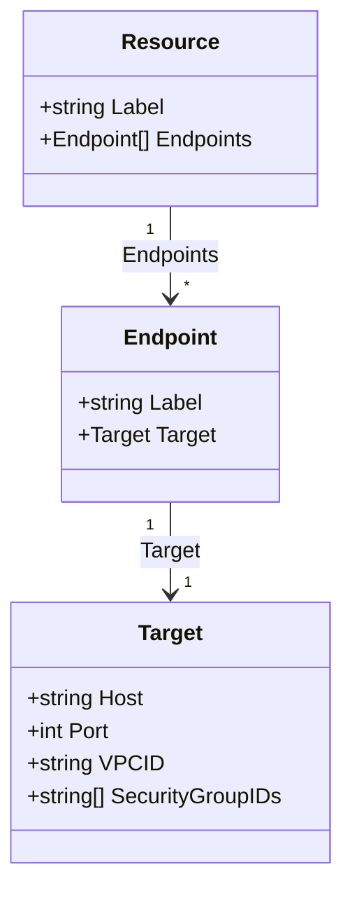

# Services

burrow discovers **remote endpoints** through pluggable AWS service providers. Each provider implements `services.Provider` and returns a list of `Resource` objects, each with one or more connectable `Endpoint`s.

## Provider interface

```go
type Provider interface {
    Name() string
    ListResources(ctx context.Context, cfg aws.Config) ([]Resource, error)
}
```

### Data model



| Field | Notes |
|-------|-------|
| `Resource.Label` | Shown in the resource picker (e.g. `my-cluster (Aurora cluster)`) |
| `Endpoint.Label` | e.g. `Writer endpoint`, `Reader endpoint` |
| `Target.Host` | DNS name or IP |
| `Target.VPCID` | Used for bastion VPC matching |
| `Target.SecurityGroupIDs` | Used for reachability validation |

The `Target` produced by a provider drives bastion filtering: only instances in the same VPC (when known) with security group paths to `Host:Port` are shown as reachable.

Providers register at init time:

```go
func init() {
    services.Register(&Provider{})
}
```

Enable a provider with a blank import in `main.go`.

---

## Built-in providers

### RDS

**Package:** `internal/services/rds`  
**Menu name:** `RDS`  
**AWS APIs:** `DescribeDBClusters`, `DescribeDBInstances`, `DescribeDBClusterEndpoints`, `DescribeDBSubnetGroups`

#### What it lists

| Resource type | Label pattern | Endpoints |
|---------------|---------------|-----------|
| Aurora / multi-AZ clusters | `{id} (Aurora cluster)` | Writer endpoint, reader endpoint, custom cluster endpoints, per-member instance endpoints |
| Standalone DB instances | `{id} ({engine})` | Instance endpoint |

Cluster members that belong to a cluster are **not** duplicated as standalone instances.

#### Port defaults

When AWS does not return a port, defaults are inferred from engine:

| Engine family | Default port |
|---------------|-------------|
| postgres, aurora-postgresql | 5432 |
| mysql, mariadb, aurora-mysql | 3306 |
| sqlserver-* | 1433 |
| oracle-* | 1521 |
| other | 5432 |

#### Security groups & VPC

- Cluster endpoints inherit VPC from the DB subnet group and SGs from `VpcSecurityGroups` on the cluster.
- Instance endpoints use instance SGs, falling back to cluster SGs for cluster members.

---

### ElastiCache

**Package:** `internal/services/elasticache`  
**Menu name:** `ElastiCache`  
**AWS APIs:** `DescribeReplicationGroups`, `DescribeCacheClusters`, `DescribeCacheSubnetGroups`

#### What it lists

| Resource type | Label pattern | Endpoints |
|---------------|---------------|-----------|
| Replication groups | `{id}` or `{id} ({description})` | Configuration endpoint (cluster mode), primary/reader per shard, individual node read endpoints |
| Standalone cache clusters | `{id} ({engine})` | Configuration endpoint (if present), per-node endpoints |

Cache clusters that are members of a replication group are excluded from the standalone list to avoid duplicates.

#### Port defaults

| Engine | Default port |
|--------|-------------|
| Redis (default) | 6379 |
| Memcached | 11211 |

#### Security groups & VPC

VPC and security groups are resolved from cache subnet groups and cluster metadata. Replication groups inherit metadata from their member cache clusters.

---

### Manual host / IP

**Not a registered provider** — handled directly in the TUI (`internal/tui/steps/manual.go`).

The user enters:

- Hostname or IP address
- Remote port

Manual targets have **no VPC ID or security groups**, so bastion reachability validation is limited:

- 10.0.0.0/8 private IP check on bastions still applies
- Target ingress validation is skipped (warning shown if bastion is selected)
- VPC matching is skipped

Use manual mode for endpoints not covered by a provider (e.g. internal HTTP services, custom EC2).

---

### OpenSearch

**Package:** `internal/services/opensearch`  
**Menu name:** `OpenSearch`  
**AWS APIs:** `ListDomainNames`, `DescribeDomain`

#### What it lists

| Resource type | Label pattern | Endpoints |
|---------------|---------------|-----------|
| Managed domains | `{name}` or `{name} ({engine version})` | Custom endpoint (if enabled), VPC endpoint (IPv4/dual-stack), public endpoint (non-VPC domains) |

Domains being deleted are skipped.

#### Port defaults

OpenSearch Service uses HTTPS. All endpoints default to port **443**.

#### Security groups & VPC

VPC ID and security group IDs are taken from `VPCOptions` on the domain. Public (non-VPC) domains have no VPC/SG metadata, so bastion reachability validation is limited to private IP checks on the bastion.

---

## Adding a new provider

Example skeleton for OpenSearch:

1. Create `internal/services/opensearch/opensearch.go`:

```go
package opensearch

import (
    "context"

    "github.com/aws/aws-sdk-go-v2/aws"
    "github.com/eichemberger/burrow/internal/services"
)

type Provider struct{}

func init() { services.Register(&Provider{}) }

func (p *Provider) Name() string { return "OpenSearch" }

func (p *Provider) ListResources(ctx context.Context, cfg aws.Config) ([]services.Resource, error) {
    // Call AWS APIs, return []services.Resource with populated Targets
    return nil, nil
}
```

2. Blank-import in `main.go`:

```go
_ "github.com/eichemberger/burrow/internal/services/opensearch"
```

3. Rebuild. The new name appears in the service step automatically.

### Checklist for a good provider

- Populate `Target.Host` and `Target.Port` for every endpoint.
- Set `Target.VPCID` when available (improves bastion filtering).
- Set `Target.SecurityGroupIDs` when available (enables SG reachability checks).
- Use clear `Label` strings — they appear in searchable lists.
- Paginate AWS list calls for accounts with many resources.

---

## AWS permissions per provider

Minimum IAM actions (in addition to EC2/SSM bastion permissions):

| Provider | Typical actions |
|----------|-----------------|
| RDS | `rds:DescribeDBClusters`, `rds:DescribeDBInstances`, `rds:DescribeDBClusterEndpoints`, `rds:DescribeDBSubnetGroups` |
| ElastiCache | `elasticache:DescribeReplicationGroups`, `elasticache:DescribeCacheClusters`, `elasticache:DescribeCacheSubnetGroups` |
| OpenSearch | `es:ListDomainNames`, `es:DescribeDomain` |

Session start always requires `ssm:StartSession` on the bastion instance (or appropriate resource tag / path constraints).
