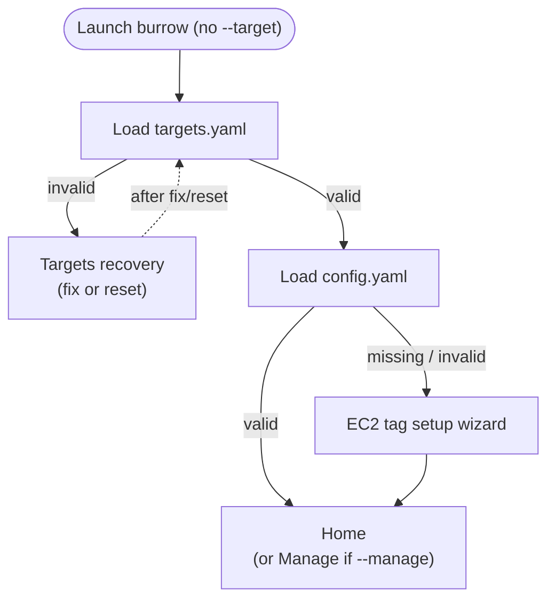

# TUI & wizard

The interactive UI is built with [Bubble Tea](https://github.com/charmbracelet/bubbletea) (Elm-style model/update/view). Each wizard screen is a separate step model under `internal/tui/steps/`.

## Startup sequence

## Home screen

| Option | Action |
|--------|--------|
| Connect to a new server | Starts full wizard from credentials |
| Connect to a saved connection | Pick alias → preflight → session |
| Manage connections | Add / edit / delete saved targets |

## Connection wizard steps

| Step | Model | Purpose |
|------|-------|---------|
| Profile | `ProfileModel` | Environment credentials or AWS profile picker |
| Region | `RegionModel` | AWS region |
| Service | `ServiceModel` | RDS, ElastiCache, or manual |
| Resource | `ResourceModel` | Pick cluster / replication group / etc. |
| Endpoint | `EndpointModel` | Pick writer, reader, node, … (skipped if only one) |
| Manual | `ManualModel` | Host + port entry (manual path only) |
| Bastion | `BastionModel` | Searchable list of reachable SSM instances |
| Local port | `LocalPortModel` | localhost bind port |
| Save target | `SaveTargetModel` | Optional alias (Enter empty to skip) |
| Run | `RunModel` | Preflight + AWS CLI session |

`--profile` and `--region` flags skip the corresponding pickers when provided.

## Step routing

The root `App` model (`internal/tui/app.go`) holds:

- Current `Step` enum
- `Session` struct (wizard progress: profile, region, AWS config, chosen resource, bastion, ports)
- Child step model
- Loaded `targetstore` and `configstore`

Steps communicate with the app via typed messages (`internal/tui/steps/messages.go`). The app translates messages into step transitions — e.g. `BastionSelected` → `LocalPortModel`.

## Bastion step details

When `BastionModel` loads:

1. Calls `bastion.ListReachable` with the selected endpoint's `Target` and EC2 tag filters from `config.yaml`.
2. Shows a spinner while evaluating.
3. Renders a searchable list of instances passing filters.
4. If the selected bastion uses CIDR-based SG access (not SG-to-SG reference), shows a confirmation prompt.

Subtitle reflects whether EC2 tag filtering is active.

## Session step details

`RunModel` runs in two phases:

1. **Preflight** — `ssmexec.VerifyInstanceOnline` via AWS SDK (SSM ping status).
2. **Exec** — `tea.ExecProcess` runs `aws ssm start-session` with stdout/stderr wired to the terminal.

On success the TUI exits when the session ends. On failure the app transitions to `SessionErrorModel`.

## Error handling

### Session errors (`SessionErrorModel`)

Shown when preflight or `start-session` fails. Common cases:

| Kind | Typical cause | Hints shown |
|------|---------------|-------------|
| Not connected | Instance stopped, SSM agent offline, logged off | Create new connection with different bastion |
| Not found | Instance deleted, wrong account/region credentials | Instance may be deleted; credentials may be for wrong account |
| Access denied | IAM permissions | Check SSM/start-session permissions |

Actions:

| Key | Action |
|-----|--------|
| `n` | Start new connection wizard |
| `b` | Back to saved connections (when connecting from saved target) |
| `h` | Home |
| `q` | Quit |

### Targets recovery (`TargetsRecoveryModel`)

Shown when `targets.yaml` is corrupt. See [Configuration](configuration.md#recovery-flows).

### Config setup (`SetupModel`)

Multi-phase EC2 tag filter collection. Saved to `config.yaml` on completion.

## Keyboard conventions

Shared across list steps (`internal/tui/steps/common.go`):

| Key | Action |
|-----|--------|
| `↑` / `↓` | Navigate list |
| `/` | Search / filter |
| `Enter` | Select |
| `Esc` | Cancel search |
| `b` / `Esc` (not searching) | Back |
| `q` / `Ctrl+C` | Quit (before session starts) |

During an active SSM session, Ctrl+C ends the session (handled by AWS CLI, not the TUI).

## Styling

Terminal chrome lives in `internal/ui/styles.go`:

- Page layout with optional wizard breadcrumb
- Lipgloss color palette (accent, muted, error, warning)
- List delegate with selected-row accent rail

Steps call helpers like `ui.PageHeading`, `ui.LoadingLine`, and `ui.ErrorStyle` for consistency.

## Testing

TUI step models are not individually unit tested; package-level logic (bastion filtering, config validation, ssmexec error classification) has tests. Run `make test` before changes that touch discovery or session code.
